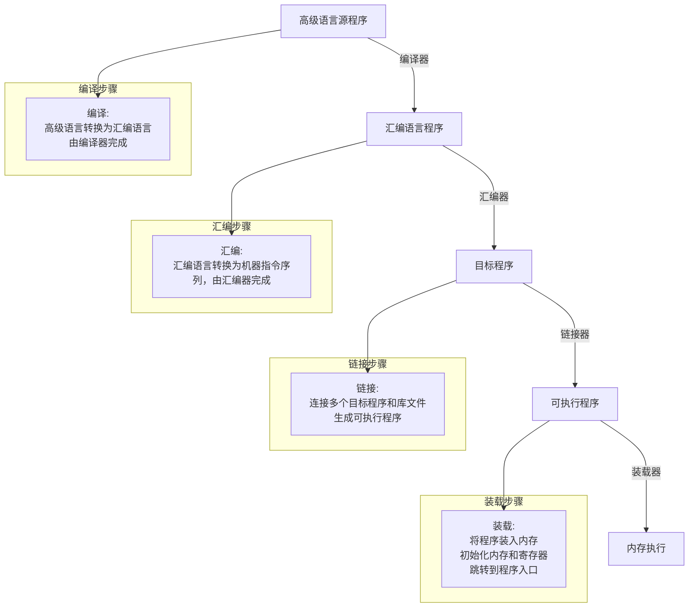
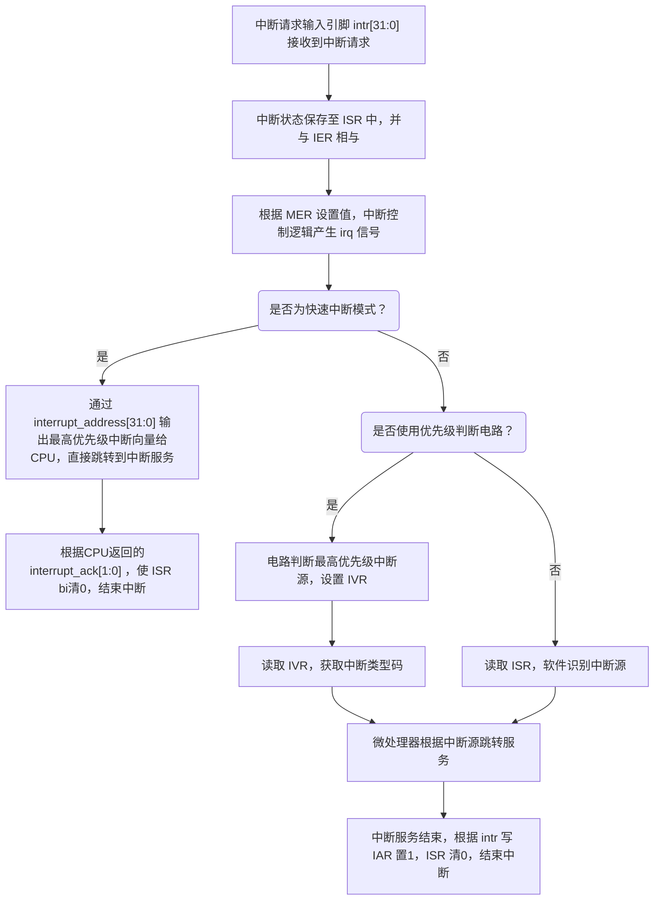
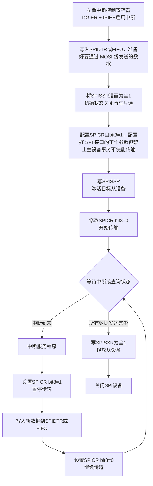

# Chapter 2 汇编语言

## :star:编码方式

### R型指令
>• 所有的操作数为寄存器操作数的指令


Op：操作码的编码，表明该指令的基本功能
- Rs：第一个源操作数寄存器的编号
- Rt：第二个源操作数寄存器的编号
- Rd：目的操作数寄存器的编号
- shamt：移位指令的移位次数编码
- funct：功能码，确定op域范围内的具体的指令功能


### I型指令
>• 其中一个操作数为寄存器操作数，另一个操作数为立即数的指令


- op：操作码的编码，表明该指令的基本功能；
- rs：第二个操作数寄存器的编号；
- rt：第一个操作数寄存器的编号；
- 常数地址（constant address）：常数或内存地址偏移量（立即数）的二进制编码。


### J型指令
>•伪直接跳转指令，这类指令为无条件跳转指令


## 寻址方式

### 操作数寻址：处理器获取数据的方式
  1. 立即数寻址
>立即数直接编码在机器指令中，因此与指令存储在一起

- 由于机器码的位数限制，**一条MIPS指令只能实现16位数据赋值**
- 借助如下两条汇编指令可实现**32位立即数的赋值**
```assembly
  lui指令：处理32位立即数的高16位,低 16 位清零
    ori指令：处理32位立即数的低16位
```

2.  寄存器寻址
>寄存器寻址是指操作数在寄存器中，而指令中给出寄存器的编号。

3.  基址寻址
>基址寻址是指操作数的地址由一个基址寄存器和一个偏移量共同决定。

   `lw $t0, 4($sp)  # 从栈顶偏移4字节处加载数据到$t0寄存器`

### 指令寻址：处理器获取指令的方式
>• CPU将要执行的下一条指令的地址保存在$PC中，通常（顺序执行时）下一条指令的地址 = 当前指令地址 + 4。出现跳转时：

1. PC相对寻址
   > 要寻找的下一条指令的地址由PC寄存器的值和一个相对偏移量构成，偏移量的计算由汇编工具完成

- 机器码中的Imm16：表示标号Label处指令存储外置到当前指令存储位置的偏移量，并且单位是间隔的指令条数（因为每条指令4字节固定）。
- 新PC的值 = PC原始值 + Imm16 X 4
2. 伪直接寻址
   > J型指令中的地址字段是目标地址的一部分。实际的跳转地址由PC高4位与指令中26位地址字段左移2位拼接而成。

   

3. 寄存器间接寻址
   > 操作数的地址在寄存器中，指令给出寄存器的编号。如jr指令，跳转地址存放在寄存器中。

## :star:常用MIPS汇编指令

### 常用指令集


#### 算术运算指令
| 类型 | 指令 | 指令举例 | 含义 | 备注 |
|------|------|----------|------|------|
| 加法 | add | add $s1,$s2,$s3 | $s1=$s2+$s3 | 三个寄存器操作数 |
| 减法 | sub | sub $s1,$s2,$s3 | $s1=$s2-$s3 | 三个寄存器操作数 |
| 加立即数 | addi | addi $s1,$s2,20 | $s1=$s2+20 | 用来加立即数 |
| 有符号乘法 | mult | mult $s1,$s2 | HI:LO=$s1*$s2 | 64位结果存入HI和LO |
| 有符号除法 | div | div $s1,$s2 | LO=$s1/$s2, HI=$s1%$s2 | 商在LO,余数在HI |
| 从HI读取 | mfhi | mfhi $s1 | $s1=HI | 获取HI寄存器值 |
| 从LO读取 | mflo | mflo $s1 | $s1=LO | 获取LO寄存器值 |

#### 数据传送指令
| 类型 | 指令 | 指令举例 | 含义 | 备注 |
|------|------|----------|------|------|
| 读取字 | lw | lw $s1,20($s2) | $s1=mem[$s2+20] | 从内存读字到寄存器 |
| 存储字 | sw | sw $s1,20($s2) | mem[$s2+20]=$s1 | 从寄存器写字到内存 |
| 读取半字 | lh | lh $s1,20($s2) | $s1=mem[$s2+20] | 从内存读半字到寄存器 |
| 读取无符号半字 | lhu | lhu $s1,20($s2) | $s1=mem[$s2+20] | 从内存读半字到寄存器 |
| 存储半字 | sh | sh $s1,20($s2) | mem[$s2+20]=$s1 | 从寄存器写半字到内存 |
| 读取字节 | lb | lb $s1,20($s2) | $s1=mem[$s2+20] | 从内存读字节到寄存器 |
| 读取无符号字节 | lbu | lbu $s1,20($s2) | $s1=mem[$s2+20] | 从内存读字节到寄存器 |
| 存储字节 | sb | sb $s1,20($s2) | mem[$s2+20]=$s1 | 从寄存器写字节到内存 |
| 读取高位立即数 | lui | lui $s1,20 | $s1=20*2^16 | 读取一个常数到高16位 |

#### 逻辑运算指令
| 类型 | 指令 | 指令举例 | 含义 | 备注 |
|------|------|----------|------|------|
| 与 | and | and $s1,$s2,$s3 | $s1=$s2&$s3 | 三个寄存器位与 |
| 或 | or | or $s1,$s2,$s3 | $s1=$s2\|$s3 | 三个寄存器位或 |
| 或非 | nor | nor $s1,$s2,$s3 | $s1=~($s2\|$s3) | 三个寄存器位或非 |
| 与立即数 | andi | andi $s1,$s2,20 | $s1=$s2&20 | 寄存器与立即数位与 |
| 或立即数 | ori | ori $s1,$s2,20 | $s1=$s2\|20 | 寄存器与立即数位或 |
| 逻辑左移 | sll | sll $s1,$s2,10 | $s1=$s2<<10 | 左移常数次 |
| 逻辑右移 | srl | srl $s1,$s2,10 | $s1=$s2>>10 | 右移常数次 |

#### 条件跳转指令
| 类型 | 指令 | 指令举例 | 含义 | 备注 |
|------|------|----------|------|------|
| 相等跳转 | beq | beq $s1,$s2,25 | if($s1=$s2) goto PC+4+25*4 | 相等测试并跳转 |
| 不相等跳转 | bne | bne $s1,$s2,25 | if($s1!=$s2) goto PC+4+25*4 | 不相等测试并跳转 |
| 小于设置 | slt | slt $s1,$s2,$s3 | if($s2<$s3) $s1=1 else $s1=0 | 比较小于则设置 |
| 小于无符号设置 | sltu | sltu $s1,$s2,$s3 | if($s2<$s3) $s1=1 else $s1=0 | 无符号比较小于则设置 |

#### 无条件跳转指令
| 类型 | 指令 | 指令举例 | 含义 | 备注 |
|------|------|----------|------|------|
| 直接跳转 | j | j 2500 | goto 2500*4 | 跳转到目标地址 |
| 间接跳转 | jr | jr $ra | goto $ra | 用于分支和子程序返回 |
| 跳转并链接 | jal | jal 2500 | $ra=PC+4; goto 2500*4 | 用于子程序调用 |}}

#### 系统功能调用: syscall

执行 syscall 指令步骤：

1. 在 $v0 中设置功能号
2. 根据功能需求设置入口参数
3. 执行 syscall 指令
4. 处理返回的输出参数

<div style="display: flex; justify-content: center;">
   
   
</div>

### C语言基本功能的汇编实现

#### 1. if语句实现
```assembly
# 如果 (i == j) 则 f = g + h; 否则 f = g - h;
   bne $s3,$s4,Else    # 如果 i != j，跳转到Else
   add $s0,$s1,$s2     # f = g + h (i == j的情况)
   j Exit              # 跳过else部分
Else: sub $s0,$s1,$s2   # f = g - h (i != j的情况)
Exit:                   # 下一条语句
```

#### 2. while循环实现
```assembly
# 当 save[i] == k 时 i += 1;
Loop: sll $t1,$s3,2     # $t1 = i * 4
     add $t1,$t1,$s6   # $t1 = save[i]的地址
     lw $t0,0($t1)     # $t0 = save[i]的值
     bne $t0,$s5,Exit  # 如果 save[i] != k，退出循环
     addi $s3,$s3,1    # i = i + 1
     j Loop            # 返回循环测试
Exit:                   # 下一条语句
```

#### 3. for循环实现 
```assembly
# for (i=0; i<n; i++) sum += A[i];
     li $s0,0         # i = 0
Loop: slt $t0,$s0,$s1  # 如果 i < n，则 $t0 = 1
     beq $t0,$0,Exit  # 如果 i >= n，退出循环
     sll $t1,$s0,2    # $t1 = i * 4
     add $t2,$s2,$t1  # $t2 = A[i]的地址
     lw $t3,0($t2)    # $t3 = A[i]的值
     add $s3,$s3,$t3  # sum += A[i]
     addi $s0,$s0,1   # i++
     j Loop
Exit:
```

#### 4. switch语句实现
```assembly
# switch(k) {
#   case 0: f=i+j; break;
#   case 1: f=g+h; break;
#   case 2: f=g-h; break;
#   default: f=i-j; break;
# }
     slti $t0,$s5,0    # 判断 k < 0?
     bne $t0,$0,Def    # 如果 k < 0，跳转到默认情况
     slti $t0,$s5,3    # 判断 k < 3?
     beq $t0,$0,Def    # 如果 k >= 3，跳转到默认情况
     sll $t1,$s5,2     # k * 4 用于跳转表
     la $t2,JumpTable
     add $t1,$t1,$t2   # 计算跳转表项的地址
     lw $t0,0($t1)     # 从表中获取地址
     jr $t0            # 跳转到对应的case

JumpTable:
     .word Case0,Case1,Case2

Case0: add $s0,$s3,$s4  # k=0的情况: f = i + j
     j Exit
Case1: add $s0,$s1,$s2  # k=1的情况: f = g + h
     j Exit
Case2: sub $s0,$s1,$s2  # k=2的情况: f = g - h
     j Exit
Def:  sub $s0,$s3,$s4   # 默认情况: f = i - j
Exit:                    # 下一条语句
```

## 程序装载

### 基本概念

| 程序类型 | 说明 |
|---------|------|
| 高级语言源程序 | 用高级语言编写的人类可读程序 |
| 汇编语言程序 | 用汇编语言编写的人类可读程序 |
| 目标程序 | 经汇编器翻译获得的机器指令序列 |
| 可执行程序 | 可被系统调用并直接执行的程序 |


## MIPS汇编程序设计
### 宏汇编基本指令

宏汇编语言包含三类基本指令：

1. **符号指令**
   - 用符号表示的机器指令，由汇编器直接翻译成机器码

2. **伪指令**

   1. **.data**: 声明数据段的开始
      - 格式： [name:] directive initializer [, initializer] . . .
      - 例： `var1: .WORD 10`
     1. **.text**: 声明代码段的开始
     2. **.globl**: 声明全局符号，通常用于函数或变量，使其可以被其他文件访问
     3. **.align**: 对齐指令，通常用于确保数据在内存中的对齐方式; Aligns the next data definition on a **2^n** byte boundary（只对下一个定义的数据有效）

3. **宏指令** 
   - 代表一组指令序列
   - 在汇编时展开成相应的指令序列
   - 用于简化重复性代码编写


# Chapter 3 微处理器

## :star::star2::sparkles:3.1 简单MIPS微处理器各部件原理及设计


## 3.4 异常处理技术

### 异常处理定义
计算机在正常运行过程中，可能由于各种原因（如硬件错误、非法指令、中断请求等），导致 CPU 暂停当前程序的执行，转而去处理临时发生的异常事件。处理完毕后，系统会返回原程序继续执行。

### 微处理器实现异常处理所需功能
- 记录异常发生的**原因**（例如：中断、非法操作等）
- 记录程序**断点处的指令地址**（即保存当前 PC 值）
- 记录不同异常类型的处理程序地址（如中断向量表）
- 建立异常类型与其对应处理程序地址的映射关系

### 异常事件识别

### 异常返回机制：断点保存和返回
1. **寄存器法**（适用于嵌入式系统，**实现异常处理的嵌套还是需要用栈**）:
    微处理器内部设置一个特殊寄存器：`EPC`（Exception Program Counter）当发生异常时：将当前程序计数器 PC 的值保存到 EPC；异常处理完成后将 EPC 的值重新赋给 PC，实现程序从中断点恢复执行。
    
2.   **栈方法**（常用于通用处理器，**可以实现异常处理嵌套**）
    当异常发生时：将当前的 PC 值压入栈中（Stack）；异常处理完成后：从栈顶弹出保存的 PC 值，恢复到异常前的位置继续执行

### 异常处理程序进入方式
**异常向量（中断向量）**：异常处理程序的入口地址
**中断向量表**: 保存异常处理程序的入口地址的内存区域

(1）**专门的内存区域保存异常处理程序**：在这块内存区域中为每个异常处理程序分配固定长度的空间如32个字节或8条指令长度的空间，而且针对每个异常事件其异常处理程序的存放地址是固定的。
(2)**仅提供一个异常处理程序存放地址**: 发生任何异常事件都首先转移到该地址执行总的异常处理，并在总异常处理程序中分析异常事件的原因，然后再根据异常的原因通过子程序调用的方式去执行相应的异常处理。
(3)**分配一块专门的内存区域保存异常处理程序的入口地址**: 
异常处理程序可以存放在内存中的任意位置，只需要把该异常处理程序的入口地址保存到中断向量表中正确的地址中，当异常发生时，微处理器就可以通过中断向量表查找到中断服务程序的入口地址。

# Chapter 8 中断技术

## 8.1 中断基本概念

### 中断的分类

微机系统中的中断可分为以下两大类：

1. **软中断**（软件中断）
软中断是由 **CPU 内部原因** 引起的中断，通常也被称为 **内中断**，统称为 **异常（Exception）**，进一步分为两类：
   1.   **指令引起的异常**:如非法操作码、除零错误、系统调用指令等。
   2. **处理器检测的异常**:如溢出、访问越界、对齐错误等问题由 CPU 自动检测产生。

2. **硬中断**（硬件中断）
硬中断是由 **CPU 外部事件** 引起的中断，通常简称为 **中断（Interrupt）**，进一步分为：
   1. **非屏蔽中断（NMI, Non-Maskable Interrupt）**:不能被中断屏蔽标志 IF 控制，一般用于高优先级紧急事件，如电源故障报警。
   1. **可屏蔽中断（INTR, Interrupt Request）**:受中断允许标志 IF 控制，一般用于普通外设的中断请求，如键盘、鼠标等。

### 中断控制器
（1）**中断请求信号保持与清除**:**中断源**(Interrupt Sources)：引起中断的原因或能发出中断请求的来源（通常是硬件设备）
（2）**中断源识别**
（3）**中断允许控制**
1. 模块的中断允许（中断使能寄存器）
2. CPU的中断允许（中断使能位IE）:其中断允许位为“1”时才会允许产生中断

（4）**中断优先级设置**


### 异常事件识别机制
• **状态位法（MIPS)**：在微处理器中利用一个寄存器对每种异常事件确定一个标志位，当有异常事件发生时，寄存器中对应的位置1，一个32位的寄存器可以表示32种不同类型的异常事件
• **向量法(Intel)**：对不同类型的异常事件进行编码，这个编码叫中断类型码或异常类型码

### 中断嵌套的基本原则：
* 高优先级的中断请求可以打断低级中断的服务过程；
* 同级或低一级别的中断不能打断同级别或高一级别的正在进行的中断服务过程。

### 中断模型
CPU是否能够收到可屏蔽中断，一般受三个控制位控制
* 模块的中断控制:如果要允许I/O模块的中断，则需要对GIER、IP IER进行编程
* 中断控制器的控制:则需要对IER、MER进行编程。
* CPU的控制:则需要对MSR中的I位进行编程、需要设定中断服务函数入口。


对模块、中断控制器、CPU的编程可以采用两种不同方法：
* IO/INTC等模块的API函数:可以基于已有驱动提供的API —— GPIO位于头文件xgpio.h中，INTC位于头文件xintc.h中，CPU位于头文件mb_interface.h中
* 直接地址读、写(Xil_In、Xil_Out):直接通过libc提供的输入输出语句对硬件进行直接控制 —— 位于xil_io.h中

## 8.2 MicroBlaze中断系统

- 中断向量的地址都是固定的，微处理器响应某个特定类型的中断时，不需要查询中断向量表，就可以直接根据固定的中断向量地址进入中断服务程序；
- 中断向量预留的只有8个字节存储空间，不足以保存中断服务程序；4个字节保存真正的中断服务程序入口地址，4个字节保存间接寻址跳转指令的机器码。真正的中断服务程序不是保存在中断向量地址处，而是在内存其它位置；中断向量地址处仅通过一条跳转指令转入真正的中断服务程序
-  微处理器对所有外设仅提供一个中断服务程序跳转地址（0x0000 0010），因此该中断服务程序也叫做主中断服务程序。
- 保存断点的方式不是利用堆栈，而是直接利用寄存器保存断点
- 如果系统需要支持多个外设中断请求硬件上就需要通过一个中断控制器如AXI INTC对多个中断信号进行管理；
- 软件上，需要在主中断服务程序中读取中断控制器的中断请求寄存器，以确定是哪个中断源发生了中断请求，并且需要进一步调用针对该中断源的中断服务程序。因此**主中断服务程序需要维护一个中断向量表（中断向量数组）**，并根据中断源查找相应中断服务程序

standalone操作系统中断相关系统调用：
- **void microblaze_enable_interrupts(void)**
►该函数的功能是使得MSR中的IE位为1，从而MicroBlaze微处理器可以响应外部中断。
- **void microblaze_disable_interrupts(void)**
►该函数的功能是使得MSR中的IE位为0，从而MicroBlaze微处理器不响应外部中断。
- **`void microblaze_register_handler(XInterruptHandler Handler, void *DataPtr)`**
►该函数的功能是将中断控制器主中断服务程序的地址与跳转指令结合后填入中断向量地址0x00000010处，并且将中断服务程序需要处理的参数地址传给中断服务程序。

## 8.3 中断控制器AXI INTC

**相关寄存器说明**

- IER：按位使能，控制ISR[31:0]为1的位是否产生Irq请求。
  - **1：允许产生Irq请求**
  - **0：禁止产生Irq请求**
- IAR：只写寄存器，通过向该寄存器的某一位写1，来清零ISR[31:0]中对应为1的位。在通过IER开放某位中断之前，应该先清零ISR中的标志位。在中断服务程序中，响应完中断之后，一定要写IAR相关的位为1来清零对应的ISR中的中断标志位。
- MER：使能整个中断控制器，控制INTC模块的允许和禁止
  - HIE=1：硬件使能，允许中断控制器将中断**请求信号irq**真正传递到 CPU。HIE为0时，不会输出irq到CPU，这时只能软件轮询ISR来判断是否有中断发生，irq存在的意义是避免任何情况下CPU都要轮询ISR来判断是否有中断发生，而是当irq为1才去轮询判断具体哪个中断源中断
  - ME=1：允许中断控制器工作

**AXI INTC中断处理过程**



## 8.4 GPIO中断方式接口设计

GPIO内部中断相关寄存器:


GPIO中断产生逻辑模块当检测到GPIO_DATA_IN输入数据发生变化时，就可以产生中
断信号，但是是否输出中断信号，受中断允许控制寄存器控制。中断控制逻辑与AXI 
INTC类似，但是没有优先级判断，仅2个中断源

## 8.5 AXI Timer接口设计

**(1)定时方法**
1. 软件定时缺点：
   1. 执行延迟时，CPU一直被占用，降低了CPU的效率；
   2. 不同CPU的时钟不一，要重新计算CX；
   3. 时间精度受限于CPU时钟频率
2. 硬件定时优点：
   1. **计数时不占用CPU时间**，如利用定时器/计数器产生中断信号，
   2. 可建立多任务环境，故提高了CPU效率。
   3. 时间精度高

**（2）AXI Timer寄存器**


## 8.5 AXI SPI接口


