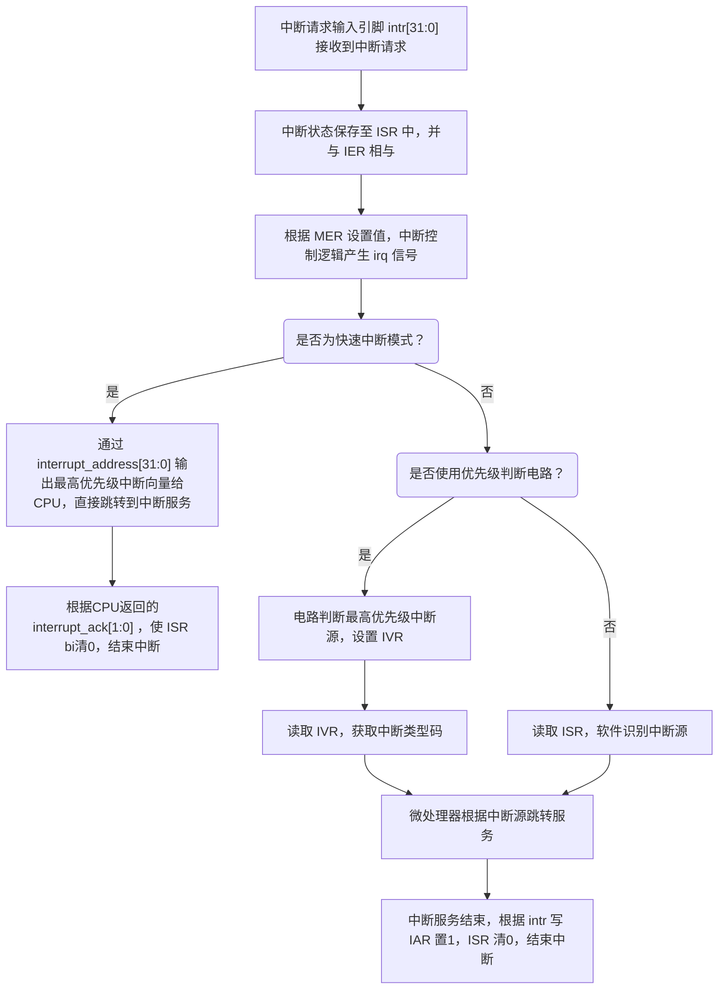
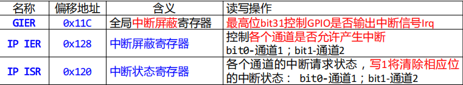

# Chapter 3 微处理器

## 3.4 异常处理技术

### 异常处理定义
计算机在正常运行过程中，可能由于各种原因（如硬件错误、非法指令、中断请求等），导致 CPU 暂停当前程序的执行，转而去处理临时发生的异常事件。处理完毕后，系统会返回原程序继续执行。

### 微处理器实现异常处理所需功能
- 记录异常发生的**原因**（例如：中断、非法操作等）
- 记录程序**断点处的指令地址**（即保存当前 PC 值）
- 记录不同异常类型的处理程序地址（如中断向量表）
- 建立异常类型与其对应处理程序地址的映射关系

### 异常事件识别

### 异常返回机制：断点保存和返回
1. **寄存器法**（适用于嵌入式系统，**实现异常处理的嵌套还是需要用栈**）:
    微处理器内部设置一个特殊寄存器：`EPC`（Exception Program Counter）当发生异常时：将当前程序计数器 PC 的值保存到 EPC；异常处理完成后将 EPC 的值重新赋给 PC，实现程序从中断点恢复执行。
    
2.   **栈方法**（常用于通用处理器，**可以实现异常处理嵌套**）
    当异常发生时：将当前的 PC 值压入栈中（Stack）；异常处理完成后：从栈顶弹出保存的 PC 值，恢复到异常前的位置继续执行

### 异常处理程序进入方式
**异常向量（中断向量）**：异常处理程序的入口地址
**中断向量表**: 保存异常处理程序的入口地址的内存区域

(1）**专门的内存区域保存异常处理程序**：在这块内存区域中为每个异常处理程序分配固定长度的空间如32个字节或8条指令长度的空间，而且针对每个异常事件其异常处理程序的存放地址是固定的。
(2)**仅提供一个异常处理程序存放地址**: 发生任何异常事件都首先转移到该地址执行总的异常处理，并在总异常处理程序中分析异常事件的原因，然后再根据异常的原因通过子程序调用的方式去执行相应的异常处理。
(3)**分配一块专门的内存区域保存异常处理程序的入口地址**: 
异常处理程序可以存放在内存中的任意位置，只需要把该异常处理程序的入口地址保存到中断向量表中正确的地址中，当异常发生时，微处理器就可以通过中断向量表查找到中断服务程序的入口地址。

# Chapter 8 中断技术

## 8.1 中断基本概念

### 中断的分类

微机系统中的中断可分为以下两大类：

1. **软中断**（软件中断）
软中断是由 **CPU 内部原因** 引起的中断，通常也被称为 **内中断**，统称为 **异常（Exception）**，进一步分为两类：
   1.   **指令引起的异常**:如非法操作码、除零错误、系统调用指令等。
   2. **处理器检测的异常**:如溢出、访问越界、对齐错误等问题由 CPU 自动检测产生。

2. **硬中断**（硬件中断）
硬中断是由 **CPU 外部事件** 引起的中断，通常简称为 **中断（Interrupt）**，进一步分为：
   1. **非屏蔽中断（NMI, Non-Maskable Interrupt）**:不能被中断屏蔽标志 IF 控制，一般用于高优先级紧急事件，如电源故障报警。
   1. **可屏蔽中断（INTR, Interrupt Request）**:受中断允许标志 IF 控制，一般用于普通外设的中断请求，如键盘、鼠标等。

### 中断控制器
（1）**中断请求信号保持与清除**:**中断源**(Interrupt Sources)：引起中断的原因或能发出中断请求的来源（通常是硬件设备）
（2）**中断源识别**
（3）**中断允许控制**
1. 模块的中断允许（中断使能寄存器）
2. CPU的中断允许（中断使能位IE）:其中断允许位为“1”时才会允许产生中断

（4）**中断优先级设置**

### 异常事件识别机制
• **状态位法（MIPS)**：在微处理器中利用一个寄存器对每种异常事件确定一个标志位，当有异常事件发生时，寄存器中对应的位置1，一个32位的寄存器可以表示32种不同类型的异常事件
• **向量法(Intel)**：对不同类型的异常事件进行编码，这个编码叫中断类型码或异常类型码

### 中断嵌套的基本原则：
* 高优先级的中断请求可以打断低级中断的服务过程；
* 同级或低一级别的中断不能打断同级别或高一级别的正在进行的中断服务过程。

### 中断模型
CPU是否能够收到可屏蔽中断，一般受三个控制位控制
* 模块的中断控制:如果要允许I/O模块的中断，则需要对GIER、IP IER进行编程
* 中断控制器的控制:则需要对IER、MER进行编程。
* CPU的控制:则需要对MSR中的I位进行编程、需要设定中断服务函数入口。

对模块、中断控制器、CPU的编程可以采用两种不同方法：
* IO/INTC等模块的API函数:可以基于已有驱动提供的API —— GPIO位于头文件xgpio.h中，INTC位于头文件xintc.h中，CPU位于头文件mb_interface.h中
* 直接地址读、写(Xil_In、Xil_Out):直接通过libc提供的输入输出语句对硬件进行直接控制 —— 位于xil_io.h中

## 8.2 MicroBlaze中断系统

- 中断向量的地址都是固定的，微处理器响应某个特定类型的中断时，不需要查询中断向量表，就可以直接根据固定的中断向量地址进入中断服务程序；
- 中断向量预留的只有8个字节存储空间，不足以保存中断服务程序；4个字节保存真正的中断服务程序入口地址，4个字节保存间接寻址跳转指令的机器码。真正的中断服务程序不是保存在中断向量地址处，而是在内存其它位置；中断向量地址处仅通过一条跳转指令转入真正的中断服务程序
-  微处理器对所有外设仅提供一个中断服务程序跳转地址（0x0000 0010），因此该中断服务程序也叫做主中断服务程序。
- 保存断点的方式不是利用堆栈，而是直接利用寄存器保存断点
- 如果系统需要支持多个外设中断请求硬件上就需要通过一个中断控制器如AXI INTC对多个中断信号进行管理；
- 软件上，需要在主中断服务程序中读取中断控制器的中断请求寄存器，以确定是哪个中断源发生了中断请求，并且需要进一步调用针对该中断源的中断服务程序。因此**主中断服务程序需要维护一个中断向量表（中断向量数组）**，并根据中断源查找相应中断服务程序

standalone操作系统中断相关系统调用：
- **void microblaze_enable_interrupts(void)**
►该函数的功能是使得MSR中的IE位为1，从而MicroBlaze微处理器可以响应外部中断。
- **void microblaze_disable_interrupts(void)**
►该函数的功能是使得MSR中的IE位为0，从而MicroBlaze微处理器不响应外部中断。
- **`void microblaze_register_handler(XInterruptHandler Handler, void *DataPtr)`**
►该函数的功能是将中断控制器主中断服务程序的地址与跳转指令结合后填入中断向量地址0x00000010处，并且将中断服务程序需要处理的参数地址传给中断服务程序。

## 8.3 中断控制器AXI INTC

**相关寄存器说明**

- IER：按位使能，控制ISR[31:0]为1的位是否产生Irq请求。
  - **1：允许产生Irq请求**
  - **0：禁止产生Irq请求**
- IAR：只写寄存器，通过向该寄存器的某一位写1，来清零ISR[31:0]中对应为1的位。在通过IER开放某位中断之前，应该先清零ISR中的标志位。在中断服务程序中，响应完中断之后，一定要写IAR相关的位为1来清零对应的ISR中的中断标志位。
- MER：使能整个中断控制器，控制INTC模块的允许和禁止
  - HIE=1：硬件使能，允许中断控制器将中断**请求信号irq**真正传递到 CPU。HIE为0时，不会输出irq到CPU，这时只能软件轮询ISR来判断是否有中断发生，irq存在的意义是避免任何情况下CPU都要轮询ISR来判断是否有中断发生，而是当irq为1才去轮询判断具体哪个中断源中断
  - ME=1：允许中断控制器工作

**AXI INTC中断处理过程**

## 8.4 GPIO中断方式接口设计

GPIO内部中断相关寄存器:

GPIO中断产生逻辑模块当检测到GPIO_DATA_IN输入数据发生变化时，就可以产生中
断信号，但是是否输出中断信号，受中断允许控制寄存器控制。中断控制逻辑与AXI 
INTC类似，但是没有优先级判断，仅2个中断源

## 8.5 AXI Timer接口设计

**(1)定时方法**
1. 软件定时缺点：
   1. 执行延迟时，CPU一直被占用，降低了CPU的效率；
   2. 不同CPU的时钟不一，要重新计算CX；
   3. 时间精度受限于CPU时钟频率
2. 硬件定时优点：
   1. **计数时不占用CPU时间**，如利用定时器/计数器产生中断信号，
   2. 可建立多任务环境，故提高了CPU效率。
   3. 时间精度高

**（2）AXI Timer寄存器**

## 8.5 AXI SPI接口