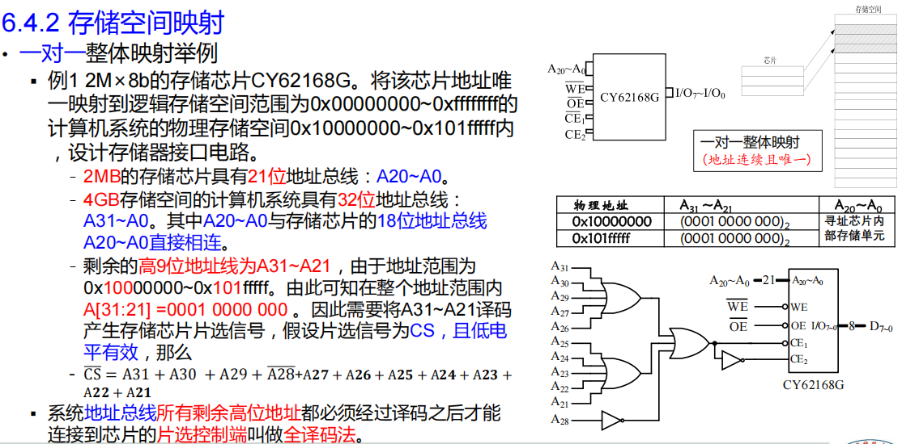

# Chapter 0 易错易漏知识点汇总

1. 共阳极数码管段码内容（程序填空）
```lua
    a
   ---
f |   | b
  | g |
   ---
e |   | c
  |   |
   ---
    d     dp

bit7    bit6  bit5  bit4  bit3  bit2  bit1  bit0  
 dp      g     f     e     d     c     b     a
```

| 显示 | 点亮段位          | 段码（dp gfedcba） | 十六进制   |
| -- | ------------- | ----------- | ------ |
| 0  | a b c d e f   | `11000000`  | `0xC0` |
| 1  | b c           | `11111001`  | `0xF9` |
| 2  | a b d e g     | `10100100`  | `0xA4` |
| 3  | a b c d g     | `10110000`  | `0xB0` |
| 4  | b c f g       | `10011001`  | `0x99` |
| 5  | a c d f g     | `10010010`  | `0x92` |
| 6  | a c d e f g   | `10000010`  | `0x82` |
| 7  | a b c         | `11111000`  | `0xF8` |
| 8  | a b c d e f g | `10000000`  | `0x80` |
| 9  | a b c d f g   | `10010000`  | `0x90` |
| A  | a b c e f g   | `10001000`  | `0x88` |
| B  | c d e f g     | `10000011`  | `0x83` |
| C  | a d e f       | `11000110`  | `0xC6` |
| D  | b c d e g     | `10100001`  | `0xA1` |
| E  | a d e f g     | `10000110`  | `0x86` |
| F  | a e f g       | `10001110`  | `0x8E` |


# Chapter 1 

## 1.1计算机系统的基本结构

### 1.1.1体系结构
- **冯诺依曼体系结构**
   - 程序指令和数据采用**统一**的存储器
   - 对程序和数据的寻址只能交替进行
   - 结构简单，易于实现，成本低
   - 传输效率低

- **哈佛体系结构**
   - 程序存储器和数据存储器分开**独立**编址
   - CPU使用两套独立的存储总线
   - 程序效率高
   - 特点：
      - 传输效率高
      - 结构复杂，扩展外围设备不易

### 1.1.2硬件结构
- 中央处理器CPU(central processor unit)/ 微处理器(microprocessor unit)
  - 算术逻辑单元ALU(Arithmetic Logic Unit)：用来进行基本的算术运算﹑逻辑运算﹑移位等各种数据操作。
   - 控制器（Control Unit）：按一定的顺序从存储器中读取指令，进行译码，在时钟信号的控制下，发出一系列的操作命令，控制整个系统有条不紊地工作。
   - 寄存器（Register）组：CPU中有多个寄存器，用来存放操作数、运算的中间结果以及反映运算结果的状态标志等。
- 存储器(memory)
  存储器的功能是存储程序、数据和各种信号、命令等信息，并在需要时提供这些信息
- 输入输出接口
  - 外部设备与CPU之间通过输入输出接口连接
  - 接口的作用
    - 一是外部设备大多数都是机电设备，传送数据的速度远远低于计算机，因而需要接口作数据缓存；
    - 二是外部设备表示信息的格式与计算机不同，由接口完成格式转换；
    - 三是接口还可以向计算机报告设备运行的状态，传达计算机的命令等。
- 输入输出设备
- 总线(Bus)
  把计算机各个部分有机地连接起来的导线，是各个部分之间进行信息交换的公共通道。
  可以分为3类：
  - 地址总线AB(address bus)：负责传输数据存储位置的一组信号, 采用Ai表示某一位地址总线。
  - 数据总线DB(data bus)：负责传输数据的一组信号线,采用Di表示其中的某一位数据总线
  - 控制总线CB(control bus)：在传输与交换数据时起管理控制作用的一组信号线,读信号 、写信号 、地址锁存允许信号ALE(address latch enable) 、 中断响应信号 (interrupt acknowledge)等


## 1.2 计算机系统的基本工作方式
- 计算机系统中的数据
  
## 1.3信息的表示方式、存储方式

### 1.3.1数制转换（10进制转K进制）：
  - 整数部分“除K取余”，直到商等于0，倒序排列
  - **​小数部分“乘K取整”，正序排列；会产生机器误差**
### 1.3.2整数
  - 机器数所代表的实际数值，称为机器数的真值；
  - 整数在计算机中采用补码表示。
  - 负数原码转补码：从**正数原码**的最低位向最高位扫描，保留直到第一个“1”的所有位，以后各位（**包括符号位**）按位取反。
  - 从负数补码求其所对应的十进制数：**补码**的最低位向最高位扫描，保留直到第一个“1”的所有位，以后各位按位取反，再将所得的数按“权”展开，即得到该补码所对应的**负数的绝对值**。
  
### 1.3.3小数的表示
  - 定点数（小数点固定的数）
    - 我们把小数点之后有n位叫做Qn，例如小数点之后有12位叫做Q12格式的定点小数，而Q0就是我们所说的整数
    - Qn越大，数的范围越小，但精度越高；Qn越小，数的范围越大，但精度越低；
  - 浮点数
    - ==转换要注意的点：先把数字转换成2进制，E和M的位数要写全，记下E为8、11bits即可==
     - **S（符号位）**  
        - S = 0 表示正数  
        - S = 1 表示负数

     - **E（阶码）**  
        - 采用**移码**表示正负指数  
        - 单精度（32位）：E = e + 127  
        - 双精度（64位）：E = e + 1023  

     - **M（尾数）**  
        - 尾数域表示的值为 1.M（==**二进制**==）  
        - 尾数域的最高有效位默认为 1（不存储）  
        - 若最高位不是 1，需要调整阶码并移动小数点，使其成为规格化表示


### 1.3.4 字符的表示


### 1.3.5 数的储存
>在计算机中，内存可**寻址**的最小存储单位是**字节**
存储器存取数据的的最小单位是**位（bit）**


字节数（halfword、word、doubleword）的地址
– Big endian方式（高对低、低对高） ：先从高位开始存储、以MSB所在的地址作为整个数的地址
– Little endian方式（高对高、低对低）：先从低位开始存储、以LSB所在的地址作为整个数的地址

### 1.3.6 数的运算
#### 无符号数运算

- 相加
   - 两个 8/16/32 位无符号数相加，结果为 9/17/33 位（最高位为进位 CF）。
- 相减
   - 计算时注意借位。


#### 有符号数算术运算

- 符号位参与运算，将符号数视为无符号数处理。
- 溢出标志位 OF 表示是否溢出：
   - OF = 0：无溢出
   - OF = 1：有溢出
- 溢出判断方法：
   1. **将符号数转为十进制，判断结果是否超出8/16/32位的表示范围。**
      1. 8位：-128 ~ 127
      2. 16位:-32,768 ~ 32,767
      3. 32位：-2,147,483,648 ~ 2,147,483,647
   2. 设符号位向更高位进位为 CY，数值部分向符号部分进位为 CS，则：
       - $$ OF = CY \oplus CS $$
       - （减法需通过求补转为加法）


#### 浮点数运算
>当参与运算的两数阶码相差较大，尾数移位可能带来较大误差
1. 操作数检查
2. 比较阶码大小并对阶（指数向E更大的数对齐，尾数右移）
3. 尾数求和
4. 结果规范化
5. 舍入处理
6. 溢出处理


# Chapter 2 汇编语言


## 两种指令集

### 复杂指令集计算机（CISC）

- **设计目标**：强化指令功能，实现软件功能向硬件功能转移。
- **主要特点**：
   1. 指令系统复杂庞大，指令数量通常多达 200~300 条。
   2. **支持多种寻址方式。**
   3. 指令格式多样。
   4. **指令字长不固定**。
   5. 访存指令无限制，可直接操作内存。
   6. 各种指令的使用频率差异较大。
   7. 各种指令的执行时间差异较大。
- **适用场景**：通用计算机。
- **典型代表**：Intel X86 系列 CPU。
  
### 精简指令集计算机（RISC）

- **设计目标**：尽量降低指令集复杂性，简化硬件实现，提高性能。
- **主要特点**：
   1. 指令系统精简，常用指令和流水线操作均可用硬件高效执行。
   2. 大量寄存器，**绝大多数操作在寄存器之间完成，提高处理速度。**
   3. 每条指令功能简单，通常可在一个机器周期内完成。
   4. 所有**指令长度一致**（如 32 位或 64 位）。
   5. **仅有 Load/Store 指令访问存储器**，其余操作均在寄存器间进行。
- **适用场景**：专用计算机。
- **典型代表**：MIPS R3000、HP-PA8000、Motorola M88000 等。
## :star:编码方式

### R型指令
>• 所有的操作数为寄存器操作数的指令


Op：操作码的编码，表明该指令的基本功能
- Rs、Rd、Rt：
  - 三操作数R型指令的符号指令格式：`op Rd Rs Rt`
  - 两操作数R型指令（srl、sll）：`srl rd, rt, shamt`(移位指令不用Rs寄存器)
- shamt：移位指令的移位次数编码（srl、sll）
- funct：功能码，确定op域范围内的具体的指令功能


### I型指令
>• 其中一个操作数为寄存器操作数，另一个操作数为立即数的指令


- op：操作码的编码，表明该指令的基本功能；
- rs、rt
  - ==数据传输指令（lw、sw）中为 `op Rt （Imm）Rs`==
  - 条件跳转指令（beq、bne）中为`op Rs Rt Imm`
  - 立即数参与运算（addi、ori）中为`op Rt Rs Imm`
- 立即数Imm
  - 数据传输指令（lw、sw）中为 ==字节偏移==
  - 条件跳转指令（beq、bne）中为 ==指令数偏移,注意是跳过的指令数==
  - 立即数参与运算（addi、ori）中为数值


### J型指令
>•伪直接跳转指令，这类指令为无条件跳转指令

J型指令排除掉6位操作数后，用于跳转地址的只有26位，需要微处理器还原成32位（真实地址）
- address左移两位再补0得到PsudeoPC（28位伪地址），是地址偏移量，（不左移2位是字节偏移量）
- NewPC（PC+4）的高四位与PsudeoPC进行拼接得到32真实跳转地址，


## 寻址方式

### 操作数寻址：处理器获取数据的方式
  1. 立即数寻址
>立即数直接编码在机器指令中，因此与指令存储在一起

- 由于机器码的位数限制，**一条MIPS指令只能实现16位数据赋值**
- 借助如下两条汇编指令可实现**32位立即数的赋值**
```assembly
  lui指令：处理32位立即数的高16位,低 16 位清零
    ori指令：处理32位立即数的低16位
```

2.  寄存器寻址
>寄存器寻址是指操作数在寄存器中，而指令中给出寄存器的编号。

3.  基址寻址
>基址寻址是指操作数的地址由一个基址寄存器和一个偏移量共同决定。

   `lw $t0, 4($sp)  # 从栈顶偏移4字节处加载数据到$t0寄存器`

### 指令寻址：处理器获取指令的方式
>• CPU将要执行的下一条指令的地址保存在$PC中，通常（顺序执行时）下一条指令的地址 = 当前指令地址 + 4。出现跳转时：

1. PC相对寻址
   > 要寻找的下一条指令的地址由PC寄存器的值和一个相对偏移量构成，偏移量的计算由汇编工具完成

- 机器码中的Imm16：表示标号Label处指令存储外置到当前指令存储位置的偏移量，并且单位是间隔的指令条数（因为每条指令4字节固定）。
- 新PC的值 = PC原始值 + Imm16 X 4
2. 伪直接寻址
   > J型指令中的地址字段是目标地址的一部分。实际的跳转地址由PC高4位与指令中26位地址字段左移2位拼接而成。

   

3. 寄存器间接寻址
   > 操作数的地址在寄存器中，指令给出寄存器的编号。如jr指令，跳转地址存放在寄存器中。

## :star:常用MIPS汇编指令

### 常用指令集


#### 算术运算指令
| 类型 | 指令 | 指令举例 | 含义 | 备注 |
|------|------|----------|------|------|
| 加法 | add | add $s1,$s2,$s3 | $s1=$s2+$s3 | 三个寄存器操作数 |
| 减法 | sub | sub $s1,$s2,$s3 | $s1=$s2-$s3 | 三个寄存器操作数 |
| 加立即数 | addi | addi $s1,$s2,20 | $s1=$s2+20 | 用来加立即数 |
| 有符号乘法 | mult | mult $s1,$s2 | HI:LO=$s1*$s2 | 64位结果存入HI和LO |
| 有符号除法 | div | div $s1,$s2 | LO=$s1/$s2, HI=$s1%$s2 | 商在LO,余数在HI |
| 从HI读取 | mfhi | mfhi $s1 | $s1=HI | 获取HI寄存器值 |
| 从LO读取 | mflo | mflo $s1 | $s1=LO | 获取LO寄存器值 |

#### 数据传送指令
| 类型 | 指令 | 指令举例 | 含义 | 备注 |
|------|------|----------|------|------|
| 读取字 | lw | lw $s1,20($s2) | $s1=mem[$s2+20] | 从内存读字到寄存器 ==20为**字节**偏移==|
| 存储字 | sw | sw $s1,20($s2) | mem[$s2+20]=$s1 | 从寄存器写字到内存 ==20为**字节**偏移==||
| 读取半字 | lh | lh $s1,20($s2) | $s1=mem[$s2+20] | 从内存读半字到寄存器 |
| 读取无符号半字 | lhu | lhu $s1,20($s2) | $s1=mem[$s2+20] | 从内存读半字到寄存器 |
| 存储半字 | sh | sh $s1,20($s2) | mem[$s2+20]=$s1 | 从寄存器写半字到内存 |
| 读取字节 | lb | lb $s1,20($s2) | $s1=mem[$s2+20] | 从内存读字节到寄存器 |
| 读取无符号字节 | lbu | lbu $s1,20($s2) | $s1=mem[$s2+20] | 从内存读字节到寄存器 |
| 存储字节 | sb | sb $s1,20($s2) | mem[$s2+20]=$s1 | 从寄存器写字节到内存 |
| 读取高位立即数 | lui | lui $s1,20 | $s1=20*2^16 | 读取一个常数到高16位 |

#### 逻辑运算指令
| 类型 | 指令 | 指令举例 | 含义 | 备注 |
|------|------|----------|------|------|
| 与 | and | and $s1,$s2,$s3 | $s1=$s2&$s3 | 三个寄存器位与 |
| 或 | or | or $s1,$s2,$s3 | $s1=$s2\|$s3 | 三个寄存器位或 |
| 或非 | nor | nor $s1,$s2,$s3 | $s1=~($s2\|$s3) | 三个寄存器位或非 |
| 与立即数 | andi | andi $s1,$s2,20 | $s1=$s2&20 | 寄存器与立即数位与 |
| 或立即数 | ori | ori $s1,$s2,20 | $s1=$s2\|20 | 寄存器与立即数位或 |
| 逻辑左移 | sll | sll $s1,$s2,10 | $s1=$s2<<10 | 左移常数次 |
| 逻辑右移 | srl | srl $s1,$s2,10 | $s1=$s2>>10 | 右移常数次 |

#### 条件跳转指令
| 类型 | 指令 | 指令举例 | 含义 | 备注 |
|------|------|----------|------|------|
| 相等跳转 | beq | beq $s1,$s2,25 | if($s1=$s2) goto PC+4+25*4 | 相等测试并跳转 |
| 不相等跳转 | bne | bne $s1,$s2,25 | if($s1!=$s2) goto PC+4+25*4 | 不相等测试并跳转 |
| 小于设置 | slt | slt $s1,$s2,$s3 | `if($s2<$s3) $s1=1 else $s1=0 `| 比较小于则设置 |
| 小于无符号设置 | sltu | sltu $s1,$s2,$s3 | if($s2<$s3) $s1=1 else $s1=0 | 无符号比较小于则设置 |

#### 无条件跳转指令
| 类型 | 指令 | 指令举例 | 含义 | 备注 |
|------|------|----------|------|------|
| 直接跳转 | j | j 2500 | goto 2500*4 | 跳转到目标地址 |
| 间接跳转 | jr | jr $ra | goto $ra | 用于分支和子程序返回 |
| 跳转并链接 | jal | jal 2500 | $ra=PC+4; goto 2500*4 | 用于子程序调用 |}}


### C语言基本功能的汇编实现

#### 1. if语句实现
```c
// 如果 a == b，则 max = a；否则 max = b；
if (a == b)
    max = a;
else
    max = b;
```
```assembly
bne $s1, $s2, Else     # if a != b，跳转到 Else
    move $s3, $s1          # max = a
    j Exit
Else: move $s3, $s2        # max = b
Exit:
```

#### 2. while循环实现
```c
// 查找第一个为0的数组元素
while (A[i] != 0)
    i++;
```
```assembly
Loop: sll $t1, $s0, 2       # $t1 = i * 4
      add $t1, $t1, $s1     # $t1 = &A[i]
      lw $t2, 0($t1)        # $t2 = A[i]
      beq $t2, $0, Exit     # 若 A[i] == 0，退出
      addi $s0, $s0, 1      # i++
      j Loop
Exit:
```

#### 3. for循环实现 
```c
// 求数组元素之和
sum = 0;
for (i = 0; i < n; i++)
    sum += A[i];
```
```assembly
    li $s0, 0              # i = 0
    li $s2, 0              # sum = 0
Loop: slt $t0, $s0, $s1     # if i < n
      beq $t0, $0, Exit     # if not, exit
      sll $t1, $s0, 2       # $t1 = i * 4
      add $t2, $t3, $t1     # $t2 = &A[i], $t3 = base addr of A
      lw $t4, 0($t2)        # $t4 = A[i]
      add $s2, $s2, $t4     # sum += A[i]
      addi $s0, $s0, 1      # i++
      j Loop
Exit:

```

#### 4. switch语句实现

```c
// 根据 op 的值决定加减乘
switch(op) {
  case 0: result = a + b; break;
  case 1: result = a - b; break;
  case 2: result = a * b; break;
  default: result = 0; break;
}
```
```assembly
    slti $t0, $s0, 0        # if op < 0
    bne $t0, $0, Def
    slti $t0, $s0, 3        # if op >= 3
    beq $t0, $0, Def
    sll $t1, $s0, 2         # op * 4
    la $t2, JumpTable
    add $t1, $t1, $t2
    lw $t3, 0($t1)
    jr $t3

JumpTable:
    .word Case0, Case1, Case2

Case0: add $s1, $s2, $s3     # result = a + b
       j Exit
Case1: sub $s1, $s2, $s3     # result = a - b
       j Exit
Case2: mul $s1, $s2, $s3     # result = a * b
       j Exit
Def:   li $s1, 0             # result = 0
Exit:

```
## 子程序调用的堆栈操作

| 子程序相关寄存器 | 说明 |
|--------|------|
|`$a0`～`$a3`|放由主程序传递给子程序的入口参数;|
| `$v0`、`$v1` | 存放由子程序传递给主程序的返回结果 |
|`$t0` ～ `$t9`|暂时变量，被子函数使用时一般不需要保存与恢复|
|`$s0` ~ `$s7`|子函数寄存器变量。子函数如果要用到这些寄存器，必须在使用前保存并在返回之前恢寄存器的值，从而使这些寄存器的值对于调用函数没有变化|
| `$ra` | 保存子程序返回到主程序的地址 |
|`$sp`|堆栈指针|
- 栈的活动端称为栈顶,固定端称为栈底。
- 存储器的任何可用部分(只读存储器除外)均可被用来作为栈。
- 栈的伸展方向既可以从大地址向小地址,也可以从小地址向大地址,。MIPS微处理器及Intelx86微处理器都采用从**大地址向小地址方向伸展**。也就是说往栈中存储数据,$sp的值递减;从栈中读取数据,$sp的值递增。
- 主程序与子程序公用寄存器的保存问题：**栈**，子程序事先用栈保存要使用的寄存器的值,再使用该寄存器;使用完之后,先恢复该寄存器的原始值,再返回主程序。

### 普通调用
**C语言子程序转汇编语言示例**
```c
int leaf_example(int g,int h,int i,int j){
   intf;
   f=(g+ h)-(i+ j);
   return f
}
```
```asm
leaf_example:                  # 定义子程序标号
   addi $sp,$sp,-4           # 修改$sp使其预留1个字的存储空间
   sw $s0,0($sp)            # 保存$s0的值到栈中
   add $t0,$a0,$a1          # $t0=g+h 
   add $t1,$a2,$a3          # $t1=i+j
   sub $s0,$t0,$t1          # $s0=(g+h)-(i+j),以上3条指令实现函数体的运算
   add $v0,$s0,$zero        # $v0=$s0+0,此指令将函数返回值保存到寄存器$v0中
   lw $s0,0($sp)            # 从栈中恢复寄存器$s0的值
   addi $sp,$sp,4           # 恢复$sp的值
   jr $ra                   # 返回到主程序处
```

### 嵌套调用
**阶乘递归子程序**
```c
// 原始程序 
int fact(int n)
if(n<1)return(1);
else return(n×fact(n-1));
```
```mips
fact:
   # 保存现场
   addi $sp,$sp,-8      # 修改栈顶指针,预留8字节存储空间保存$ra,$a0
   sw $ra,4($sp)        # 保存返回地址$ra
   sw $a0,0($sp)        # 保存参数n的值($a0)
   
   # 边界判断
   slti $t0,$a0,1       # 若n<1则$t0=1
   beq $t0,$zero,L1     # 若$t0=0(即n>=1)则跳转到L1
   
   # n<1的情况
   addi $v0,$zero,1     # 返回值为1
   addi $sp,$sp,8       # 恢复栈指针
   jr $ra               # 返回
   
L1:# n>=1的情况
   addi $a0,$a0,-1      # 计算n-1
   jal fact             # 递归调用fact(n-1),结果在$v0
   
   # 恢复现场并计算结果
   lw $a0,0($sp)        # 恢复原始n值
   lw $ra,4($sp)        # 恢复返回地址
   mul $v0,$v0,$a0      # 计算n*fact(n-1)
   addi $sp,$sp,8       # 恢复栈指针
   jr $ra               # 返回
```


### 程序储存映像

（从低地址到高地址）
1. **指令区 (.text)**  
   - 存放程序代码。

2. **静态数据区 (.data/.bss)**  
   - 存放**全局变量、常量、静态变量。**
   - **程序运行期间不会释放。**

3. **堆（Heap）**  
   - 运行时动态申请的内存（如链表、malloc）。
   - 从低地址向高地址增长，由程序分配和释放。
   - 空间不一定连续。

4. **栈（Stack）**  
   - 存放**局部自动变量、返回地址、参数寄存器**等。
   - **从高地址向低地址增长。**
   - 每次函数调用创建新程序帧`$fp`，返回时释放。`$fp`的值在子程序运行过程中不允许发生改变,因此子程序可以利用这个指针`$fp`寻址局部自动变量。
## 程序编译、装载

### 基本概念

| 程序类型 | 说明 |
|---------|------|
| 高级语言源程序 | 用高级语言编写的人类可读程序 |
| 汇编语言程序 | 用汇编语言编写的人类可读程序 |
| 目标程序 | 经汇编器翻译获得的机器指令序列 |
| 可执行程序 | 可被系统调用并直接执行的程序 |


## MIPS汇编程序设计

### 宏汇编语言
>宏汇编语言有3类基本指令：**符号指令、伪指令和宏指令**。
#### 伪指令

| 伪指令（伪操作） | 用途说明                                      | 示例                        |
|------------------|-----------------------------------------------|-----------------------------|
| `.data`          | 切换到数据段，紧接着的内容放在数据段                  | `.data <地址>`                     |
| `.text`          | 切换到代码段，紧接着的内容放在代码段              | `.text <地址>`                     |
| `.globl`         | 声明全局符号，全局变量可被外部文件使用，通常用于定义主函数入口           | `.globl main`               |
| `.word`          | 分配 4 字节并存储整数                          | `.word 100`                 |
| `.byte`          | 分配 1 字节并存储整数                          | `.byte 0xFF`                |
| `.half`          | 分配 2 字节并存储整数                          | `.half 0x1234`              |
| `.asciiz`        | 定义**以空字符结尾**的字符串（C 风格）             | `.asciiz "Hello\n"`         |
| `.ascii`         | 定义**不以空字符结尾**的字符串                     | `.ascii "Hello"`            |
| `.align n`       | 按 **2^n 字节**对齐（0=1字节，1=2字节，2=4字节）   | `.align 2`                  |
| `.space n`       | 分配 n 个字节的空间                            | `.space 16`                 |

补充：.align的细节：只对下一个定义的数据的**起始地址**有效


#### 宏指令
>将一段汇编符号指令序列定义为一条宏指令

1. 取变量或标号的地址
I型指令Immidiate只有16位 ，不能一次性处理32位的地址，需要用下面宏指令
`la $Rd ,Label`
对应：
```assembly
lui $Rd,Upper16   # 装入高16位
ori $Rd,$Rd,Lower16  # 装入低16位
```
2. 立即数初始化寄存器
`li $Rd,Imm`
Imm位宽大于16时相当于上面的两条语句，小于16相当于一个ori


### 系统功能调用: syscall

执行 syscall 指令步骤：

1. 在 $v0 中设置功能号
2. 根据功能需求设置入口参数
3. 执行 syscall 指令
4. 处理返回的输出参数

<div style="display: flex; justify-content: center;">
   
   
</div>


# Chapter 3 微处理器

## :star::star2::sparkles:3.1 简单MIPS微处理器各部件原理及设计


## 3.2 现代微处理器新技术

### 3.2.1 超标量技术
微处理器集成多个ALU、多个译码器和多条流水线，以并行处理的方式来提高性能
### 3.2.2 流水线技术
流水线具有多少个不同的执行部件，则称这条流水线具有多少级


## 3.4 异常处理技术

### 异常处理定义
计算机在正常运行过程中，可能由于各种原因（如硬件错误、非法指令、中断请求等），导致 CPU 暂停当前程序的执行，转而去处理临时发生的异常事件。处理完毕后，系统会返回原程序继续执行。

### 微处理器实现异常处理所需功能
- 记录异常发生的**原因**（例如：中断、非法操作等）
- 记录程序**断点处的指令地址**（即保存当前 PC 值）
- 记录不同异常类型的处理程序地址（如中断向量表）
- 建立异常类型与其对应处理程序地址的映射关系

### 异常事件识别

### 异常返回机制：断点保存和返回
1. **寄存器法**（适用于嵌入式系统，**实现异常处理的嵌套还是需要用栈**）:
    微处理器内部设置一个特殊寄存器：`EPC`（Exception Program Counter）当发生异常时：将当前程序计数器 PC 的值保存到 EPC；异常处理完成后将 EPC 的值重新赋给 PC，实现程序从中断点恢复执行。
    
2.   **栈方法**（常用于通用处理器，**可以实现异常处理嵌套**）
    当异常发生时：将当前的 PC 值压入栈中（Stack）；异常处理完成后：从栈顶弹出保存的 PC 值，恢复到异常前的位置继续执行

### 异常处理程序进入方式
**异常向量（中断向量）**：异常处理程序的入口地址
**中断向量表**: 保存异常处理程序的入口地址的内存区域

(1）**专门的内存区域保存异常处理程序**：在这块内存区域中为每个异常处理程序分配固定长度的空间如32个字节或8条指令长度的空间，而且针对每个异常事件其异常处理程序的存放地址是固定的。
(2)**仅提供一个异常处理程序存放地址**: 发生任何异常事件都首先转移到该地址执行总的异常处理，并在总异常处理程序中分析异常事件的原因，然后再根据异常的原因通过子程序调用的方式去执行相应的异常处理。
(3)**分配一块专门的内存区域保存异常处理程序的入口地址**: 
异常处理程序可以存放在内存中的任意位置，只需要把该异常处理程序的入口地址保存到中断向量表中正确的地址中，当异常发生时，微处理器就可以通过中断向量表查找到中断服务程序的入口地址。


# Chapter 4 存储器系统

## 存储器的作用及分类


>寄存器->cache->主存->辅存
## 基本概念

- 基于原理：程序访问内存局部性原理（时间局部性、空间局部性）
- Cache命中（Hit）：CPU访问存储器时在地址线上输出存储器的地址信息，Cache控制器将判断该地址是否与Cache中存放数据的地址一致。若一致，则命中。
- Cache非命中（Miss）： 不一致/ 没有命中的数据，CPU只好直接从内存获取。获取的同时，也把它拷进Cache，以便下次访问
- 命中率=命中cache次数/访问cache总次数

## 高速缓存（Cache）的三种地址映射方式
> Cache容量小于内存容量，需要在cache存储单元和内存存储单元之间建立某种地址映射关系。

### 1. 直接映射（Direct Mapped）

- **原理**  
   - 主存与Cache均分成大小相同的数据行（如2^n字节）。
   - 主存容量是Cache容量的整数倍，将主存空间按Cache容量分成页（块），主存中每一页的行数与Cache总行数相等。
   - **主存中某页的一行只能存入Cache中行编号相同的位置。**

- **结构**  
   - CPU的地址位数n决定可访问的物理存储空间（2^n），如**32位对应4GB**。
   - 物理地址划分：
     - 页的位数为页数的对数
     - 行索引位数为Cache行数的对数
     - 字节偏移位数为缓存行大小的对数（eg：缓存行大小为128B，则M=128）
      
   - Cache行结构：
     - 有效位1位
     - 标志位为页数的对数
     - 数据位为缓存行大小×8位。
      
   - 直接映射Cache控制器对物理地址进行划分。

- **优缺点**  
   - 优点：访问速度快，硬件实现简单。
   - 缺点：不同页中同一行位置数据频繁访问时，会不断替换同一Cache行，导致命中率低。

---

### 2. 全相联（Fully Associative）

- **原理**  
   - 主存与Cache分成相同大小的行，主存的任意一行可装入Cache任意一行。
   - Cache中的标志为内存行号，无固定映射关系，需搜索整个Cache判断是否命中。
- **结构**
  - 物理地址划分：
    - 标志位数为物理内存的行数的对数（物理存储空间大小除以缓存行大小）
    - 字节偏移位数为缓存行大小的对数
  
  - Cache行结构
    - 有效位1位
     - 标志位为物理内存的行数的对数
     - 数据位为缓存行大小×8位。
  
- **优缺点**  
   - 优点：Cache行利用率高，行冲突概率低，命中率高。
   - 缺点：访问效率低，速度慢，硬件成本高。

---

### 3. 组相联（Set Associative）

- **原理**  
   - 内存和Cache按相同大小分行和分块，Cache的块数即为“路数”。
   - 各块中编号相同的行构成一组，行号即为组号。
   - 内存数据调入Cache时，只能存入组号相同的组内，但可放在组内任意行。
   - 组间采用直接映射，组内采用全相联。

- **结构**
  - 物理地址划分：
    - 标志位数为物理内存分成路数的对数（物理存储空间大小除以缓存行大小除以组数）
    - 组索引位数为每一路组数（行数）的对数
    - 字节偏移位数为缓存行大小的对数

  - Cache行结构
    - 有效位1位
     - 标志位数为物理内存分成路数的对数（物理存储空间大小除以缓存行大小除以组数）
     - 数据位为缓存行大小×8位。

  
- **优缺点**  
   - 优点：访问速度较全相联快，Cache行利用率高，命中率高于直接映射。
   - 缺点：实现难度高于直接映射。


## Cache读策略、写策略、替换策略
## 内存的三种管理方式：分页式、分段式、段页式
## 虚拟存储技术


# Chapter 5 总线技术
>计算机中多个功能部件共享的一组信息传输线称为总线
## 总线基础
### 总线的分类
1. 按照传输信息的不同
  - **地址总线**  
  - **数据总线**  
  - **控制总线**  

2. 按照传输方式的不同
  - **串行总线**  
     - 信息各位一位接一位传输  
     - 典型例子：RS232、IIC、SPI、USB  
  - **并行总线**  
     - 信息各位一次性传输  
     - 典型例子：ISA、PCI、AXI、IDE  

3.  按照在计算机系统中的层次和位置
>**系统总线**是计算机系统中最重要的总线，人们常说的计算机总线既是指系统总线
  - **片内总线**  
     - 集成电路(IC)内部模块间通信  
     - 例：AMBA、**AXI**  
  - **局部总线**  
     - 计算机内部各外围芯片与处理器之间  
     - 例：**PCI**
  - **系统总线**  
     - 计算机内各电路板之间互连  
  - **外部总线**  
     - 计算机与外部设备之间的通信总线  
     - 例：**USB**、SATA、**SPI、IIC** 

### 计算机总线结构

### 总线仲裁与时序

1. 总线仲裁

2. 总线时序

- **同步方式**
   - 由统一的公共时钟控制数据传送，**线中包含时钟线**。

- **异步方式**
   - **采用应答方式，没有公共时钟信息**，传送的每一个操作都是由源或目的特定信号的跳变所确定，总线上每一个事件的发生取决于前一个事件的发生。

- **半同步方式**
   - 总线上各操作之间的间隔可以变化，但仅允许为公共时钟周期的整数倍。信号的出现、采样和结束仍以公共时钟为基准，ISA总线就是采用此种方法。


# Chapter 6 半导体存储器接口

## 半导体存储芯片分类
- 根据读、写操作功能分类
- 根据读写操作时序分类：异步存储器和同步存储器
- 根据数据传输的方式分类：并行存储器与串行存储器

## 储存器接口设计

### 储存容量拓展
1. 字数扩展
>可寻址存储单元数增多，地址线增多


• 字长扩展
>存储单元位宽增大，数据线增多


• 字长、字数联合扩展
>地址线、数据线均增多


### 储存空间映射

计算机系统中，微处理器能够访问的存储空间通常称为**逻辑存储空间**。
- 例如，32 位微处理器的逻辑存储空间为 4GB。

由存储芯片实际构成的存储空间称为**物理存储空间**。
- 例如，一片 1GB 存储芯片的物理存储空间仅为 1GB。

1. 一对一整体映射
>系统地址总线所有剩余高位地址都必须经过译码之后才能连接到芯片的片选控制端叫做全译码法。



2. 一对多整体映射
>部分高位地址线没有参与译码形成芯片片选控制信号。
– 仅一位高位地址线参与译码，就叫做线选法；
– 多位但不是全部高位地址线参与译码，就叫做部分译码法


# Chapter 7 I/O接口

## 7.1 接口基本概念
>接口包含两方面的含义：为实现两个设备间数据交换的电子线路（**硬件**）及其通信协议（**软件**)
1. 接口功能
• 控制和定时
• 与微处理器通信
• 与外设通信
• 数据缓冲
• 错误检测
2. CPU与接口之间通信
• 命令译码
• 数据缓冲
• 状态反馈
• 地址译码
3. I/O接口数据传送方式
- 并行数据传输
     - **传输速度快**
     - 连线数量多
     - 成本较高
     - **仅适用于短距离传输**

- 串行数据传输
     - 布线简单
     - 控制相对复杂
     - **传输距离可远**(除USB外速度较慢)

4.  **接口控制方式**

- 程序控制方式
  - 查询方式
  - 无条件传送方式
- 中断方式
- DMA方式（**效率最高的一种传输方式**）

## 7.2 I/O寻址
# Chapter 8 中断技术

## 8.1 中断基本概念

### 中断的分类

微机系统中的中断可分为以下两大类：

1. **软中断**（软件中断）
软中断是由 **CPU 内部原因** 引起的中断，通常也被称为 **内中断**，统称为 **异常（Exception）**，进一步分为两类：
   1.   **指令引起的异常**:如非法操作码、除零错误、系统调用指令等。
    
# Chapter 8 中断技术

## 8.1 中断基本概念

### 中断的分类

微机系统中的中断可分为以下两大类：

1. **软中断**（软件中断）
软中断是由 **CPU 内部原因** 引起的中断，通常也被称为 **内中断**，统称为 **异常（Exception）**，进一步分为两类：
   1.   **指令引起的异常**:如非法操作码、除零错误、系统调用指令等。
   2. **处理器检测的异常**:如溢出、访问越界、对齐错误等问题由 CPU 自动检测产生。

2. **硬中断**（硬件中断）
硬中断是由 **CPU 外部事件** 引起的中断，通常简称为 **中断（Interrupt）**，进一步分为：
   1. **非屏蔽中断（NMI, Non-Maskable Interrupt）**:不能被中断屏蔽标志 IF 控制，一般用于高优先级紧急事件，如电源故障报警。
   1. **可屏蔽中断（INTR, Interrupt Request）**:受中断允许标志 IF 控制，一般用于普通外设的中断请求，如键盘、鼠标等。

### 中断控制器
（1）**中断请求信号保持与清除**:**中断源**(Interrupt Sources)：引起中断的原因或能发出中断请求的来源（通常是硬件设备）
（2）**中断源识别**
（3）**中断允许控制**
1. 模块的中断允许（中断使能寄存器）
2. CPU的中断允许（中断使能位IE）:其中断允许位为“1”时才会允许产生中断

（4）**中断优先级设置**


### 异常事件识别机制
• **状态位法（MIPS)**：在微处理器中利用一个寄存器对每种异常事件确定一个标志位，当有异常事件发生时，寄存器中对应的位置1，一个32位的寄存器可以表示32种不同类型的异常事件
• **向量法(Intel)**：对不同类型的异常事件进行编码，这个编码叫中断类型码或异常类型码

### 中断嵌套的基本原则：
* 高优先级的中断请求可以打断低级中断的服务过程；
* 同级或低一级别的中断不能打断同级别或高一级别的正在进行的中断服务过程。

### 中断模型
CPU是否能够收到可屏蔽中断，一般受三个控制位控制
* 模块的中断控制:如果要允许I/O模块的中断，则需要对GIER、IP IER进行编程
* 中断控制器的控制:则需要对IER、MER进行编程。
* CPU的控制:则需要对MSR中的I位进行编程、需要设定中断服务函数入口。


对模块、中断控制器、CPU的编程可以采用两种不同方法：
* IO/INTC等模块的API函数:可以基于已有驱动提供的API —— GPIO位于头文件xgpio.h中，INTC位于头文件xintc.h中，CPU位于头文件mb_interface.h中
* 直接地址读、写(Xil_In、Xil_Out):直接通过libc提供的输入输出语句对硬件进行直接控制 —— 位于xil_io.h中

## 8.2 MicroBlaze中断系统

- 中断向量的地址都是固定的，微处理器响应某个特定类型的中断时，不需要查询中断向量表，就可以直接根据固定的中断向量地址进入中断服务程序；
- 中断向量预留的只有8个字节存储空间，不足以保存中断服务程序；4个字节保存真正的中断服务程序入口地址，4个字节保存间接寻址跳转指令的机器码。真正的中断服务程序不是保存在中断向量地址处，而是在内存其它位置；中断向量地址处仅通过一条跳转指令转入真正的中断服务程序
-  微处理器对所有外设仅提供一个中断服务程序跳转地址（0x0000 0010），因此该中断服务程序也叫做主中断服务程序。
- 保存断点的方式不是利用堆栈，而是直接利用寄存器保存断点
- 如果系统需要支持多个外设中断请求硬件上就需要通过一个中断控制器如AXI INTC对多个中断信号进行管理；
- 软件上，需要在主中断服务程序中读取中断控制器的中断请求寄存器，以确定是哪个中断源发生了中断请求，并且需要进一步调用针对该中断源的中断服务程序。因此**主中断服务程序需要维护一个中断向量表（中断向量数组）**，并根据中断源查找相应中断服务程序

standalone操作系统中断相关系统调用：
- **void microblaze_enable_interrupts(void)**
►该函数的功能是使得MSR中的IE位为1，从而MicroBlaze微处理器可以响应外部中断。
- **void microblaze_disable_interrupts(void)**
►该函数的功能是使得MSR中的IE位为0，从而MicroBlaze微处理器不响应外部中断。
- **`void microblaze_register_handler(XInterruptHandler Handler, void *DataPtr)`**
►该函数的功能是将中断控制器主中断服务程序的地址与跳转指令结合后填入中断向量地址0x00000010处，并且将中断服务程序需要处理的参数地址传给中断服务程序。

## 8.3 中断控制器AXI INTC

**相关寄存器说明**

- IER：按位使能，控制ISR[31:0]为1的位是否产生Irq请求。
  - **1：允许产生Irq请求**
  - **0：禁止产生Irq请求**
- IAR：只写寄存器，通过向该寄存器的某一位写1，来清零ISR[31:0]中对应为1的位。在通过IER开放某位中断之前，应该先清零ISR中的标志位。在中断服务程序中，响应完中断之后，一定要写IAR相关的位为1来清零对应的ISR中的中断标志位。
- MER：使能整个中断控制器，控制INTC模块的允许和禁止
  - HIE=1：硬件使能，允许中断控制器将中断**请求信号irq**真正传递到 CPU。HIE为0时，不会输出irq到CPU，这时只能软件轮询ISR来判断是否有中断发生，irq存在的意义是避免任何情况下CPU都要轮询ISR来判断是否有中断发生，而是当irq为1才去轮询判断具体哪个中断源中断
  - ME=1：允许中断控制器工作

**AXI INTC中断处理过程**


## 8.4 GPIO中断方式接口设计

GPIO内部中断相关寄存器:


GPIO中断产生逻辑模块当检测到GPIO_DATA_IN输入数据发生变化时，就可以产生中
断信号，但是是否输出中断信号，受中断允许控制寄存器控制。中断控制逻辑与AXI 
INTC类似，但是没有优先级判断，仅2个中断源

## 8.5 AXI Timer接口设计

**(1)定时方法**
1. 软件定时缺点：
   1. 执行延迟时，CPU一直被占用，降低了CPU的效率；
   2. 不同CPU的时钟不一，要重新计算CX；
   3. 时间精度受限于CPU时钟频率
2. 硬件定时优点：
   1. **计数时不占用CPU时间**，如利用定时器/计数器产生中断信号，
   2. 可建立多任务环境，故提高了CPU效率。
   3. 时间精度高

**（2）AXI Timer寄存器**


3. 定时器配置流程

- 初始化定时器
  - 停止定时器：写 TCSR，使 ENT=0
  - 清除中断标志：写 TINT=1
  - 清除 MDT，使其为 0
  - 设置 UDT 为 0 或 1，选择加/减计数
  - 设置 ARHT=1，控制定时器计数结束时自动装载预置值
  - 使能中断：写 TCSR，使 ENINT=1
  - 写 TLR，配置计数初始值
  - 装载 TCR：写 TCSR，使 LOAD=1（初始化一次性装载）
- 运行定时器：写 TCSR，使 ENT=1，LOAD=0，此时定时器以用户设置的初始值开始计数

注意LOAD每次必须先清零再置1才有用，因为是上升沿有效

>初始化值为0x172，运行时赋值1d2，区别就在于ENT与LOAD两位

## 8.5 AXI SPI接口

**（1）SPI寄存器**


1. **控制寄存器SPICR**


   - CPOL、CPHA为01或10时信号采样在SCLK下降沿，同为0或同为1时在SCLK上升沿采样

2. **状态寄存器SPISR**

==读1响应的中断源产生中断，写1清除相对应的中断状态==

**（2）配置流程**


# Chapter 9 DMA技术

## DMA传输原理

1. **DMA传输系统**  
   DMA（Direct Memory Access，直接存储器访问）是一种允许外设在无需CPU干预的情况下，直接与内存进行数据交换的机制。DMA控制器负责管理数据的传输过程，减轻CPU负担，提高数据传输效率。

2. **DMA传输方向**  
   - **外设到内存**：如数据采集、串口/网络接收等场景，将外设数据写入内存。
   - **内存到外设**：如数据输出、串口/网络发送等场景，将内存数据写到外设。
   - **内存到内存**:  采用块传输方式（连续多个字节传输）
>若计算机系统 I/O 接口采用存储器映像方式寻址，那么存储器到存储器与存储器到 I/O 设备之间 DMA 传输不同之处在于：DMA 数据传输过程中 I/O 设备端口地址不发生改变。

3. **DMA传输模式**  

- 单字节传输
- 块传输：DMAC连续传输多个字节，没传输一个字节字节计数器减一，直到0
- 请求传输：外设DMA请求信号DMAQ有效时才传输
- 级联传输：


1. **DMA传输流程**  
   1. CPU初始化DMA控制器，设置源地址、目的地址、传输长度和方向等参数。
   2. 外设或CPU向DMA控制器发起DMA请求。
   3. DMA控制器向CPU申请总线控制权（总线仲裁）。
   4. 获得总线后，DMA控制器自动完成数据传输。
   5. 传输完成后，DMA控制器可通过中断通知CPU。

2. **DMA响应条件**  
   - DMA请求信号有效（如外设产生DMA请求）。
   - CPU允许DMA访问总线（如未屏蔽DMA）。
   - 总线空闲或DMA获得总线仲裁权。
   - DMA控制器配置正确，且传输参数有效。

## UartLite


# Chapter 10 人机接口

## 图形显示输出设备

## VGA接口控制器